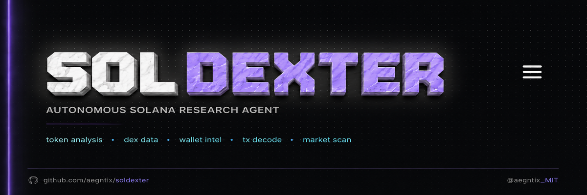
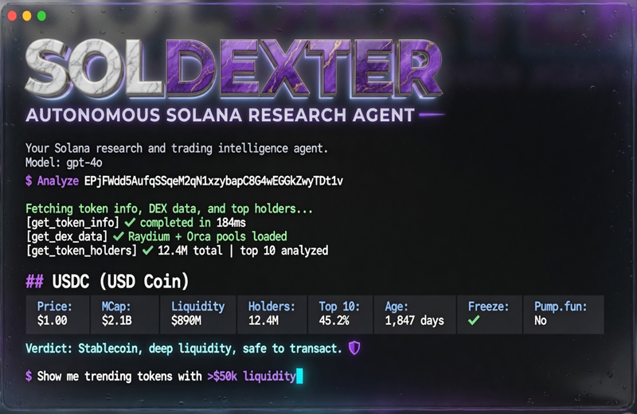

<p align="center">
  
</p>

<p align="center">
  <strong>Autonomous Solana research & trading intelligence agent.</strong><br>
  Think Claude Code, but built for Solana.
</p>

<p align="center">
  <a href="https://github.com/aegntic/soldexter/releases"></a>
  <a href="https://github.com/aegntic/soldexter/blob/main/LICENSE"></a>
  <a href="https://github.com/aegntic/soldexter/stargazers"></a>
  
  
  
</p>

---

<p align="center">
  
</p>

## What is Soldexter?

Soldexter is a terminal-native AI agent that takes natural language questions about Solana tokens, wallets, and markets — then autonomously researches them using live on-chain and off-chain data.

It decomposes complex questions into multi-step research plans, executes 6+ tools in parallel, cross-references results, and produces actionable trading intelligence. All from your terminal.

### Key Features

- **Rich TUI setup (2026-06 milestone)** — Attention-grabbing value hooks during first-run (e.g. "80% of what makes Soldexter feel like having a full research desk"), paste/enter/esc key input, immediate "capability unlocked". Verified e2e with real Helios + dummies; keys hot-reload live for tools. Polished banner with "GPT 4o mini" display.
- **6 Solana-native tools** — Token analysis, DEX data, wallet forensics, TX decode, trending tokens, holder analysis
- **Parallel execution** — Tools run concurrently with automatic cross-referencing
- **Subagent spawning** — Delegate sub-tasks to isolated parallel agents
- **Persistent memory** — Knowledge survives across sessions
- **Paper-trade default** — Jupiter swap quotes without execution, live requires explicit double opt-in
- **Multiple LLM backends** — OpenAI, Anthropic, Google, or local via Ollama

## Quick Start

The recommended way is the **in-app guided setup** (built exactly for this):

```bash
# After clone + install
cd soldexter
bun install

# Just run it
bun run dev          # or the installed `soldexter` binary
```

On first launch (or while critical keys are missing) Soldexter shows a rich, step-by-step walkthrough:

- Clear explanations of the *real* capabilities each key unlocks (on-chain forensics, smart-money detection, accurate pricing + momentum, the reasoning engine, etc.).
- "Why this is worth your time" value hooks and attention-grabbing examples ("ask which wallets bought in the first 5 min and are still holding").
- Direct paste prompts with full context.
- After you add a key you immediately see proof it is working (the agent becomes dramatically more powerful in front of your eyes).

You can still set keys the old way (exports or .env) — the app will detect them and skip the corresponding steps.

Manual (for CI / advanced):

```bash
export HELIUS_API_KEY=...
export BIRDEYE_API_KEY=...
export OPENAI_API_KEY=...   # or ANTHROPIC_*, XAI_*, GOOGLE_*, or run local Ollama
bun run dev
```

## Tools

| Tool | Description | Source |
|------|-------------|--------|
| `get_token_info` | Token metadata, supply, freeze authority, age, creator, pump.fun detection | Helius DAS |
| `get_dex_data` | Live price, volume, liquidity, price changes, DEX pair data | Birdeye |
| `get_wallet_activity` | Wallet transaction history — parsed swaps, transfers, amounts, programs | Helius RPC |
| `decode_transaction` | Full forensic breakdown: programs, inner instructions, token transfers, fees | Helius |
| `get_trending_tokens` | Trending tokens by volume/momentum with liquidity filtering | Birdeye |
| `get_token_holders` | Top holders with supply concentration and wallet labels | Helius |
| `web_search` | Web search via Exa, Tavily, Perplexity, or LangSearch | Multi |
| `browser` | JavaScript-rendered page navigation and scraping | Playwright |
| `memory` | Persistent knowledge base across sessions | Local |
| `spawn_subagent` | Delegate focused sub-tasks to parallel agents | Internal |

## Example Sessions

### Token Deep Dive

```
> Analyze EPjFWdd5AufqSSqeM2qN1xzybapC8G4wEGGkZwyTDt1v (USDC)

Soldexter: Fetching token info, DEX data, and top holders...
[parallel: get_token_info, get_dex_data, get_token_holders]

## USDC (USD Coin)
Price: $1.00 | MCap: $2.1B | Liquidity: $890M
Holders: 12.4M | Top 10: 45.2%
Age: 1,847 days | Freeze: None ✅ | Pump.fun: No ✅
Verdict: Stablecoin, deep liquidity, safe to transact.
```

### Wallet Intelligence

```
> What is 7x4kX... doing right now?

Soldexter: Looking up wallet labels and recent activity...
[parallel: get_wallet_activity, search_wallet_labels, get_wallet_pnl]

## Wallet 7x4kX... Profile
Label: Known whale | 30d P&L: +$2.3M (+187%) | Win rate: 71%
Last action: Bought 85 SOL of POPE (3 min ago)
Pattern: Loading new meme launches — typical early-entry behavior.
```

### Market Scanner

```
> Show me trending tokens with >$50k liquidity

Soldexter: [get_trending_tokens with min_liquidity=50000]

## Trending (24h)
1. BONK2 — $0.0000034 (+187%, Vol: $4.2M, Liq: $890k)
2. MEW — $0.0023 (+94%, Vol: $2.1M, Liq: $340k)
3. POPE — $0.00000012 (+312%, Vol: $1.8M, Liq: $89k) ⚠️ Low liq
```

### Transaction Forensics

```
> Decode tx 5UjH...qKP2

Soldexter: [decode_transaction]

## Transaction Breakdown
Type: Swap | Program: Jupiter Aggregator v6
Token In: 50 SOL ($7,250) → Token Out: 42.3M BONK
Fee: 0.00005 SOL | Priority: 0.0001 SOL | CU: 204,800
Inner instructions: 4 (spl-token transfers, account updates)
Verdict: Standard Jupiter swap, no suspicious patterns.
```

## Data Sources

| Provider | Capabilities |
|----------|-------------|
| [Helius](https://helius.xyz) | Solana RPC, DAS API, enhanced transactions, wallet labels, webhooks |
| [Birdeye](https://birdeye.so) | Token prices, OHLCV candles, trending tokens, wallet P&L |
| [Jupiter v6](https://station.jup.ag) | Swap quotes, route planning, paper-trade / live execution |

## Architecture

```
┌─────────────────────────────────────────────┐
│                  Soldexter                   │
├──────────┬──────────┬───────────┬───────────┤
│   Agent  │  Tools   │ Providers │  Memory   │
│   Core   │  (6+)    │  (3)      │ (persist) │
├──────────┴──────────┴───────────┴───────────┤
│           Subagent Spawning Layer            │
├──────────────────────────────────────────────┤
│  Helius RPC │ Birdeye API │ Jupiter v6 API   │
└──────────────────────────────────────────────┘
```

Built on [Dexter](https://github.com/virattt/dexter)'s proven agent loop:
- **Plan → Execute → Validate → Refine** — Iterative research with self-correction
- **Parallel tool execution** — Multiple data sources queried simultaneously
- **Context window management** — Handles long sessions without degradation
- **JSONL scratchpad** — Full audit log of every agent decision and tool call

## Trading & Safety

Soldexter defaults to **paper-trade mode**. Swap quotes are fetched from Jupiter and displayed without executing any on-chain transaction.

To enable live trading (requires explicit double opt-in):

```bash
export EXECUTION_ENABLED=true     # opt-in 1
export MAINNET_ENABLED=true       # opt-in 2
export SOLANA_KEYPAIR=path/to/keypair.json
```

Both flags must be set. Paper mode is always the default.

## Environment Variables

| Variable | Required | Description |
|----------|----------|-------------|
| `HELIUS_API_KEY` | Yes | Helius RPC and DAS API access |
| `BIRDEYE_API_KEY` | Yes | Birdeye price and market data |
| `OPENAI_API_KEY` | One LLM | OpenAI GPT models |
| `ANTHROPIC_API_KEY` | or | Anthropic Claude models |
| `GOOGLE_API_KEY` | or | Google Gemini models |
| `EXECUTION_ENABLED` | No | Enable swap execution (opt-in 1) |
| `MAINNET_ENABLED` | No | Enable mainnet transactions (opt-in 2) |
| `SOLANA_KEYPAIR` | No | Path to Solana keypair for execution |

## Tech Stack

- **Runtime**: [Bun](https://bun.sh)
- **Language**: TypeScript
- **Agent Framework**: [LangChain.js](https://js.langchain.com)
- **Terminal UI**: [Ink](https://github.com/vadimdemedes/ink) (React for CLI)
- **Browser**: [Playwright](https://playwright.dev)
- **Zod** schemas for structured tool I/O

## Contributing

Contributions are welcome. Open an issue or PR.

1. Fork the repo
2. Create a feature branch (`git checkout -b feat/my-feature`)
3. Commit your changes
4. Open a pull request

## License

[MIT](LICENSE)

## Credits

- **Soldexter**: [Mattae Cooper (@aegntix)](https://x.com/aegntix) / [aegntic](https://github.com/aegntic)
- **Dexter** (original): [Virat Singh (@virattt)](https://x.com/virattt) / [Dexter Labs](https://github.com/virattt/dexter)

---

<p align="center">
  <sub>Built with ☉ by <a href="https://x.com/aegntix">@aegntix</a> · Powered by <a href="https://helius.xyz">Helius</a>, <a href="https://birdeye.so">Birdeye</a>, <a href="https://station.jup.ag">Jupiter</a></sub>
</p>

## License

Copyright (c) 2026 aegntic

Permission is hereby granted, free of charge, to any person obtaining a copy of this software and associated documentation files (the "Software"), to deal in the Software **for personal use and development only**, subject to the following conditions:

The above copyright notice and this permission notice shall be included in all copies or substantial portions of the Software.

**Commercial, re-sale, group, team, or enterprise use requires** a donation of $99 (or equivalent) to the maintainers (via GitHub Sponsors or specified) **and** prominent acknowledgement in the work and documentation.

THE SOFTWARE IS PROVIDED "AS IS", WITHOUT WARRANTY OF ANY KIND, EXPRESS OR IMPLIED, INCLUDING BUT NOT LIMITED TO THE WARRANTIES OF MERCHANTABILITY, FITNESS FOR A PARTICULAR PURPOSE AND NONINFRINGEMENT. IN NO EVENT SHALL THE AUTHORS OR COPYRIGHT HOLDERS BE LIABLE FOR ANY CLAIM, DAMAGES OR OTHER LIABILITY, WHETHER IN AN ACTION OF CONTRACT, TORT OR OTHERWISE, ARISING FROM, OUT OF OR IN CONNECTION WITH THE SOFTWARE OR THE USE OR OTHER DEALINGS IN THE SOFTWARE.

See full LICENSE file.

## Tech Preferences

- **Rust > TypeScript** for core logic where performance matters (delegate to rektdexter engine Rust crates for heavy work like valuation, recon).
- Use **bun** for JavaScript/TypeScript (this harness, tools, skills).
- Use **astral uv** for any Python components or scripts.
- Prefer bun/uv for fast, reliable package management and execution in agent flows.

## Roadmap & Tasks

See [ROADMAP.md](ROADMAP.md) for high-level phases (agent features, DCF/valuation integration as fundamentals layer, subagent delegation, Solana tool expansion).

See [TASKS.md](TASKS.md) or specs (SPEC.md, skills/*/SKILL.md, docs if any) for detailed tasks. Other devs welcome — fork, PR against roadmap.

## Tags

#soldexter #rektdexter #solana #ai-agent #dcf #valuation #fundamentals #bun #uv #rust #paper-trade

## Versioning & Checkpoints

Version in package.json bumped on milestones (e.g. new skills, integrations). Conventional commits, PRs. Git tags (v0.2.0). Update this README and ROADMAP on changes.

Current: DCF/valuation skill + bridge to rektdexter as high-level edge.

## Contributing

1. Align to roadmap/TASKS.
2. Use Rust for core via rektdexter engine when possible.
3. bun/uv only.
4. Paper trade first, explicit opt-in for live.
5. Update docs/README/ROADMAP.
6. License: personal/dev free; commercial/group/enterprise $99 donation + ack.
