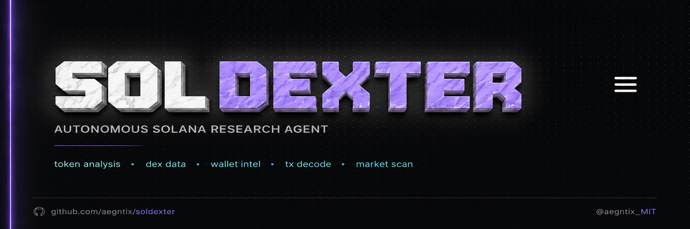
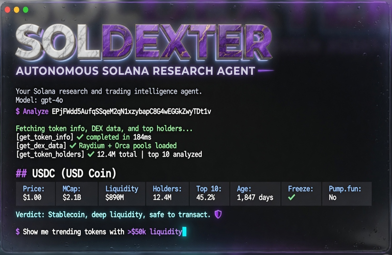

<p align="center">
  
</p>

<p align="center">
  <strong>Autonomous Solana research & trading intelligence agent.</strong><br>
  Think Claude Code, but built for Solana.
</p>

<p align="center">
  <a href="https://github.com/aegntic/soldexter/releases"></a>
  <a href="https://github.com/aegntic/soldexter/blob/main/LICENSE"></a>
  <a href="https://github.com/aegntic/soldexter/stargazers"></a>
  
  
  
</p>

---

<p align="center">
  
</p>

## What is Soldexter?

Soldexter is a terminal-native AI agent that takes natural language questions about Solana tokens, wallets, and markets — then autonomously researches them using live on-chain and off-chain data.

It decomposes complex questions into multi-step research plans, executes 6+ tools in parallel, cross-references results, and produces actionable trading intelligence. All from your terminal.

### Key Features

- **Wallet intelligence** — Five-layer wallet scan, token risk audit, and an append-only paper-trade ledger
- **6 Solana-native tools** — Token analysis, DEX data, wallet forensics, TX decode, trending tokens, holder analysis, plus GMGN OpenAPI reads
- **Parallel execution** — Tools run concurrently with automatic cross-referencing
- **Subagent spawning** — Delegate sub-tasks to isolated parallel agents
- **Persistent memory** — Knowledge survives across sessions
- **Paper-trade default** — Jupiter swap quotes without execution, live requires explicit double opt-in
- **Multiple LLM backends** — OpenAI, Anthropic, Google, or local via Ollama

## Quick Start

```bash
# Clone
git clone https://github.com/aegntic/soldexter.git
cd soldexter

# Install
bun install

# Free GMGN OpenAPI key from https://gmgn.ai/ai
# This is a query key, not a wallet key. The app boots with only this set.
export GMGN_API_KEY=your_gmgn_key

# Optional. A free Helius key speeds RPC. Public RPC is used when it is absent.
# export HELIUS_API_KEY=your_helius_key

# One LLM, or a local model for the gather step:
export OPENAI_API_KEY=your_openai_key
# export SOLDEXTER_COST_CONTROL=local
# export OLLAMA_MODEL=llama3.2

# Run
bun run dev
```

## Tools

| Tool | Description | Source |
|------|-------------|--------|
| `get_token_info` | Supply, mint and freeze authority, Token-2022 extension names | Helius if set, else public RPC |
| `get_dex_data` | Price, liquidity, market cap. Missing fields stay unverifiable | DexScreener, Jupiter price, Birdeye if set |
| `get_wallet_activity` | Wallet transaction history — parsed swaps, transfers, amounts, programs | Helius RPC when set |
| `decode_transaction` | Full forensic breakdown: programs, inner instructions, token transfers, fees | Helius when set |
| `get_trending_tokens` | Trending tokens. GMGN first, Birdeye when that feature is active | GMGN or Birdeye |
| `get_token_holders` | Top holders when Helius or GMGN can supply them. Otherwise unverifiable | Helius or GMGN |
| `scan_wallet` | 14-day five-layer wallet scan in the WALLET / TIER / SCORE block | Public RPC + GMGN |
| `audit_token_risk` | Mint, freeze, LP, bundler graph, loud honeypot / drainer / fake-airdrop flags | Public RPC, RugCheck, GMGN |
| `log_paper_signal` | Append a flagged signal with a measured price | Jupiter price or DexScreener |
| `score_paper_signals` | Score a signal at 1h, 24h, and 72h after fees and slippage | Same ledger |
| `get_token_security` | GMGN OpenAPI token security. Missing fields stay null | GMGN OpenAPI |
| `get_gmgn_trending` | GMGN OpenAPI market rank | GMGN OpenAPI |
| `get_smart_money` / `get_kol_trades` | GMGN kol and smart-money trades | GMGN OpenAPI |
| `get_gmgn_portfolio` | GMGN wallet stats. Per-token holdings are unverifiable without a signing key, which is not configured | GMGN OpenAPI |
| `web_search` | Web search via Exa, Tavily, Perplexity, or LangSearch | Multi |
| `browser` | JavaScript-rendered page navigation and scraping | Playwright |
| `memory` | Persistent knowledge base across sessions | Local |
| `spawn_subagent` | Delegate focused sub-tasks to parallel agents | Internal |

## Example Sessions

### Token Deep Dive

```
> Analyze EPjFWdd5AufqSSqeM2qN1xzybapC8G4wEGGkZwyTDt1v (USDC)

Soldexter: Fetching token info, DEX data, and top holders...
[parallel: get_token_info, get_dex_data, get_token_holders]

## USDC (USD Coin)
Price: $1.00 | MCap: $2.1B | Liquidity: $890M
Holders: 12.4M | Top 10: 45.2%
Age: 1,847 days | Freeze: None ✅ | Pump.fun: No ✅
Verdict: Stablecoin, deep liquidity, safe to transact.
```

### Wallet Intelligence

```
> Scan C1ha9J8b8KSDGvEGDC2hmYy6yN4cvcBz9AVDdpQmD3at

WALLET: C1ha9J8b8KSDGvEGDC2hmYy6yN4cvcBz9AVDdpQmD3at
TIER: UNSCORED
SCORE: unverifiable (window only partly parsed)
WIN_RATE: unverifiable (window only partly parsed, so a win rate would be a lower bound)
CONSENSUS_DEVIATION: unverifiable (no DexScreener listing or boost timestamps)
```

A number is printed only when the scan measured it, and then it includes its source and UTC time.

### Market Scanner

```
> Show me trending tokens with >$50k liquidity

Soldexter: [get_trending_tokens with min_liquidity=50000]

## Trending (24h)
1. BONK2 — $0.0000034 (+187%, Vol: $4.2M, Liq: $890k)
2. MEW — $0.0023 (+94%, Vol: $2.1M, Liq: $340k)
3. POPE — $0.00000012 (+312%, Vol: $1.8M, Liq: $89k) ⚠️ Low liq
```

### Transaction Forensics

```
> Decode tx 5UjH...qKP2

Soldexter: [decode_transaction]

## Transaction Breakdown
Type: Swap | Program: Jupiter Aggregator v6
Token In: 50 SOL ($7,250) → Token Out: 42.3M BONK
Fee: 0.00005 SOL | Priority: 0.0001 SOL | CU: 204,800
Inner instructions: 4 (spl-token transfers, account updates)
Verdict: Standard Jupiter swap, no suspicious patterns.
```

## Data Sources

What is core versus Soldextra is a default, not a final split. The only switch is `tier` on a row in `src/soldextra/registry.ts`. A feature that needs a paid key starts as soldextra. Everything else starts as core. Soldextra calls stay off until `SOLDEXTRA_ENABLED=true`.

| Source | Default | Needs |
|--------|---------|--------|
| GMGN OpenAPI (token, market, wallet stats, kol, smartmoney) | core | Free `GMGN_API_KEY`. Read-only |
| Solana public RPC | core | No key |
| DexScreener, GeckoTerminal, RugCheck, Jupiter price | core | No key |
| Helius free RPC / DAS | core | Optional `HELIUS_API_KEY` |
| Birdeye | core | Optional `BIRDEYE_API_KEY` (a free key exists). Flip the row to move it |
| Solscan Pro | soldextra | `SOLSCAN_API_KEY` |
| X API | soldextra | `X_BEARER_TOKEN` |
| Helius paid-plan calls | soldextra | `HELIUS_API_KEY` plus the flag |

GMGN swap, multi-swap, order, and cooking are not wired. The client rejects those paths. `GMGN_PRIVATE_KEY` is not read.

## Architecture

```
┌─────────────────────────────────────────────┐
│                  Soldexter                   │
├──────────┬──────────┬───────────┬───────────┤
│   Agent  │  Tools   │ Providers │  Memory   │
│   Core   │  (6+)    │  (3)      │ (persist) │
├──────────┴──────────┴───────────┴───────────┤
│           Subagent Spawning Layer            │
├──────────────────────────────────────────────┤
│  GMGN OpenAPI │ public RPC │ DexScreener │ Jupiter price │
└──────────────────────────────────────────────┘
```

Built on [Dexter](https://github.com/virattt/dexter)'s proven agent loop:
- **Plan → Execute → Validate → Refine** — Iterative research with self-correction
- **Parallel tool execution** — Multiple data sources queried simultaneously
- **Context window management** — Handles long sessions without degradation
- **JSONL scratchpad** — Full audit log of every agent decision and tool call

## Trading & Safety

Soldexter defaults to **paper-trade mode**. Swap quotes are fetched from Jupiter and displayed without executing any on-chain transaction.

To enable live trading (requires explicit double opt-in):

```bash
export EXECUTION_ENABLED=true     # opt-in 1
export MAINNET_ENABLED=true       # opt-in 2
export SOLANA_KEYPAIR=path/to/keypair.json
```

Both flags must be set. Paper mode is always the default. Wallet scans and the paper ledger do not use this gate, and they do not add a new way to send a transaction.

Paper signals append to `.dexter/paper-ledger.jsonl`. A horizon is scored only after it is due and an exit price was measured. Fees default to 30 bps and slippage to 100 bps, and both numbers are stored on the score line.

## Environment Variables

| Variable | Required | Description |
|----------|----------|-------------|
| `GMGN_API_KEY` | For GMGN queries | Free OpenAPI key from gmgn.ai/ai. Not a wallet key |
| `HELIUS_API_KEY` | No | Optional free RPC. Absent key uses the public RPC |
| `BIRDEYE_API_KEY` | No | Optional. Off until the key is set |
| `SOLDEXTRA_ENABLED` | No | Turns on features whose registry tier is soldextra |
| `SOLSCAN_API_KEY` | No | Solscan Pro. Soldextra |
| `X_BEARER_TOKEN` | No | X API. Soldextra |
| `OPENAI_API_KEY` | One LLM | OpenAI GPT models |
| `ANTHROPIC_API_KEY` | or | Anthropic Claude models |
| `GOOGLE_API_KEY` | or | Google Gemini models |
| `SOLDEXTER_COST_CONTROL` | No | `local` (Ollama) or `fast` for fetch and parse |
| `SOLDEXTER_MODEL_FETCH` | No | Override the fetch model |
| `SOLDEXTER_MODEL_PARSE` | No | Override the parse model |
| `SOLDEXTER_MODEL_SCORE` | No | Override the score model |
| `SOLDEXTER_MODEL_SYNTHESIZE` | No | Override the synthesis model |
| `EXECUTION_ENABLED` | No | Existing live-trade opt-in 1. Unchanged |
| `MAINNET_ENABLED` | No | Existing live-trade opt-in 2. Unchanged |
| `SOLANA_KEYPAIR` | No | Existing live-trade key path. The new tools never read it |

## Tech Stack

- **Runtime**: [Bun](https://bun.sh)
- **Language**: TypeScript
- **Agent Framework**: [LangChain.js](https://js.langchain.com)
- **Terminal UI**: [Ink](https://github.com/vadimdemedes/ink) (React for CLI)
- **Browser**: [Playwright](https://playwright.dev)
- **Zod** schemas for structured tool I/O

## Contributing

Contributions are welcome. Open an issue or PR.

1. Fork the repo
2. Create a feature branch (`git checkout -b feat/my-feature`)
3. Commit your changes
4. Open a pull request

## License

[MIT](LICENSE)

## Credits

- **Soldexter**: [Mattae Cooper (@aegntix)](https://x.com/aegntix) / [aegntic](https://github.com/aegntic)
- **Dexter** (original): [Virat Singh (@virattt)](https://x.com/virattt) / [Dexter Labs](https://github.com/virattt/dexter)

---

<p align="center">
  <sub>Built with ☉ by <a href="https://x.com/aegntix">@aegntix</a> · GMGN OpenAPI, public Solana RPC, DexScreener, Jupiter price</sub>
</p>
